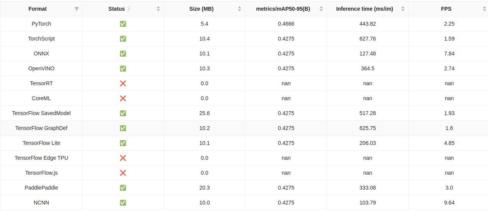

# Smart City - IoT / AI-based people frequency measurement


<a id="readme-top"></a>

<details>
  <summary>Table of Contents</summary>
  <ol>
    <li>
        <a href="#foreword">Foreword</a>
    <li>
      <a href="#about-the-project">About The Project</a>
      <ul>
        <li><a href="#built-with">Built With</a></li>
        <li><a href="#features">Features</a></li>
      </ul>
    </li>
    <li>
    <a href="#environment-variables">Environment Variables</a>
    </li>
    <li>
      <a href="#getting-started">Getting Started</a>
      <ul>
        <li><a href="#installation">Installation</a></li>
        <li><a href="#first-steps">First steps</a></li>
      </ul>
    </li>
    <li><a href="#license">License</a></li>
    <li><a href="#contact">Contact</a></li>
  </ol>
</details>

## Foreword

This project is part of a **Master's thesis** in the **M.Sc. Business Informatics** program. It is only a **prototype** and not fully tested yet.

**Important Note**: The repository owner does not own the software solutions used. Please adhere to the respective licensing terms of the software packages used, especially those licensed under **AGPL-3.0** components. Additionally, no modifications have been made to the official software packages.

## Built With

- [**Ultralytics**](https://github.com/ultralytics/ultralytics)
- [**React**](https://reactjs.org/)
- [**Flask + Hypercorn**](https://flask.palletsprojects.com/)
- [**Docker**](https://www.docker.com/)
- [**Ant Design**](https://ant.design/)

## About The Project

This project is about a containerized computer vision system based on the **Ultralytics** framework, used for counting objects in multiple defined regions (Regions of Interest, ROI). The system counts the objects entering a region and simultaneously records the entry and exit times as well as the tracking routes. The counts are published via MQTT, while a MongoDB can optionally be used for data storage and export.

The application supports various video sources, such as **Picamera2**, **OpenCV**, and **YouTube Livestreams**, as well as **CUDA-based inference** for GPU-accelerated AI computations. The entire system runs on a thread-based architecture to ensure greater stability. An optional **restart mechanism** can be used to restart the application and free up resources.

The frontend was created with **React** and is served by **Flask**.

## Features

- **Docker** containerization for scalable deployment
- **OIDC** (tested with Keycloak)
- **Live streams** via **OpenCV**, **Picamera2**, or **YouTube**
- **CUDA support** for GPU-accelerated inference
- **YOLOv8** and **YOLOv11** including export and benchmarking
- **Creation of simulation videos** for model comparison
- **Real-time resource utilization**
- **MQTT-based app control**

## Recommended Environment

- Quad Core CPU
- 4 GB RAM (8 GB recommended)
- CUDA-capable GPU
- At least 20 GB of free storage space

**Benchmark on a Raspberry PI 4 (CPU, imgsz 320):**



## Environment Variables

| **Variable**          | **Default**                                         |
| --------------------- | --------------------------------------------------- |
| `ULTRALYTICS_VERSION` | `8.3.6`                                             |
| `APP_DOMAIN`          | `http://0.0.0.0:8080`                               |
| `APP_PORT`            | `8080`                                              |
| `BENCHED`             | `False`                                             |
| `APP_REDIS_SERVER`    | `True`                                              |
| `REDIS_HOST`          | `redis`                                             |
| `REDIS_PORT`          | `6379`                                              |
| `APP_DEV_MODE`        | `False`                                             |
| `ALLOWED_ORIGINS`     | `https://first_origin.com,http://second_origin.com` |
| `SECRET_KEY`          | `secrets.token_urlsafe(16)`                         |
| `ENCRYPTION_KEY`      | `secrets.token_urlsafe(32)`                         |
| `USE_OIDC`            | `False`                                             |

If **USE_OIDC** is enabled, the following variables must be set:

| **Variable**                   | **Default**                                                     |
| ------------------------------ | --------------------------------------------------------------- |
| `OIDC_CLIENT_ID`               | `<CLIENT_ID>`                                                   |
| `OIDC_CLIENT_SECRET`           | `xxxxxxxxxxxxxxx`                                               |
| `OIDC_HOST`                    | `https://your_keycloak_server.com`                              |
| `OIDC_ISSUER`                  | `/realms/<REALM_NAME>`                                          |
| `OIDC_USERINFO_URI`            | `/realms/<REALM_NAME>/protocol/openid-connect/userinfo`         |
| `OIDC_TOKEN_INTROSPECTION_URI` | `/realms/<REALM_NAME>/protocol/openid-connect/token/introspect` |
| `OIDC_SERVER_METADATA_URL`     | `/realms/<REALM_NAME>/.well-known/openid-configuration`         |
| `OIDC_SCOPES`                  | `openid,email,profile,offline_access`                           |

As for now following variables are unused:
| **Variable** | **Default** |
| ------------------------------ | --------------------------------------------------------------- |
| `OIDC_REALM_NAME` | `<REALM_NAME>` |
| `OIDC_CERT_URL` | `/realms/<REALM_NAME>/protocol/openid-connect/certs` |
| `OIDC_TOKEN_URL` | `/realms/<REALM_NAME>/protocol/openid-connect/token` |
| `OIDC_AUTH_URI` | `/realms/<REALM_NAME>/protocol/openid-connect/auth` |
| `OIDC_TOKEN_URI` | `/realms/<REALM_NAME>/protocol/openid-connect/token` |
| `OIDC_REDIRECT_URI` | `/oidc_callback` |
| `OIDC_ALLOWED_ROLES` | `admin` |

Keycloak settings:

- Valid redirect URIs: .../oidc_callback
- Valid post logout redirect URIs .../signout

## Getting Started

- Ubuntu 22.04
- Python 3.11.x
- Docker and Compose Plugin
- Picamera2 or USB Webcam

### Installation

1. Start the required services with Docker Compose (Optional):
   - `docker compose -f docker-compose-services.yml up -d`
2. Build the Docker image for the application:
   - `docker build -f Dockerfile -t iot-app .`
3. Start the application:
   - `docker compose up iot-app`

---

### First steps

1. Run a benchmark test. Ultralytics installs additional packages.
2. Run a second benchmark test, as this is the only way to properly activate the additional packages at runtime. This will provide more realistic values for the FPS performance.
3. Define ROI and tags.
4. Optional: Test different configurations based on simulation videos.
5. Start inference and monitor performance on the dashboard.
6. Integrate MQTT and Mongo client data and enable services.

**If there is a significant discrepancy between the model FPS and system FPS, this may be due to the camera capabilities. In this case, it is advisable to reduce the camera resolution.**

## CUDA in Docker

1. Uncomment the sections in the Compose file
2. Take a look at the these compatibility lists and check your Nvidia and CUDA driver versions with `nvidia-smi`

- TF: https://www.tensorflow.org/install/source#gpu
- CUDA & cuDNN: https://docs.nvidia.com/deeplearning/cudnn/backend/latest/reference/support-matrix.html

3. Additionally follow these steps: https://docs.nvidia.com/datacenter/cloud-native/container-toolkit/latest/install-guide.html#installing-with-apt

```bash
curl -fsSL https://nvidia.github.io/libnvidia-container/gpgkey | sudo gpg --dearmor -o /usr/share/keyrings/nvidia-container-toolkit-keyring.gpg \
    && curl -s -L https://nvidia.github.io/libnvidia-container/stable/deb/nvidia-container-toolkit.list | \
    sed 's#deb https://#deb [signed-by=/usr/share/keyrings/nvidia-container-toolkit-keyring.gpg] https://#g' | \
    sudo tee /etc/apt/sources.list.d/nvidia-container-toolkit.list

sudo sed -i -e '/experimental/ s/^#//g' /etc/apt/sources.list.d/nvidia-container-toolkit.list
sudo apt-get update
sudo apt-get install -y nvidia-container-toolkit
sudo nvidia-ctk runtime configure --runtime=docker
sudo systemctl restart docker
```

---

## License

This project is licensed under the [GNU Affero General Public License v3.0 (AGPL-3.0)](https://www.gnu.org/licenses/agpl-3.0.html).

### Important Notes

- This project includes the Ultralytics software package, which is licensed under the AGPL-3.0.

Project Link: [https://github.com/OrhanSalman/IoTCountingApp](https://github.com/OrhanSalman/IoTCountingApp)

### Possible Adjustments

- Automatic scaling of ROI points when changing camera resolution
- TPU compatibility
- Not export model if already exists
- Persitent Volumes

---

**IMPORTANT: DO NOT USE IN PRODUCTION**
